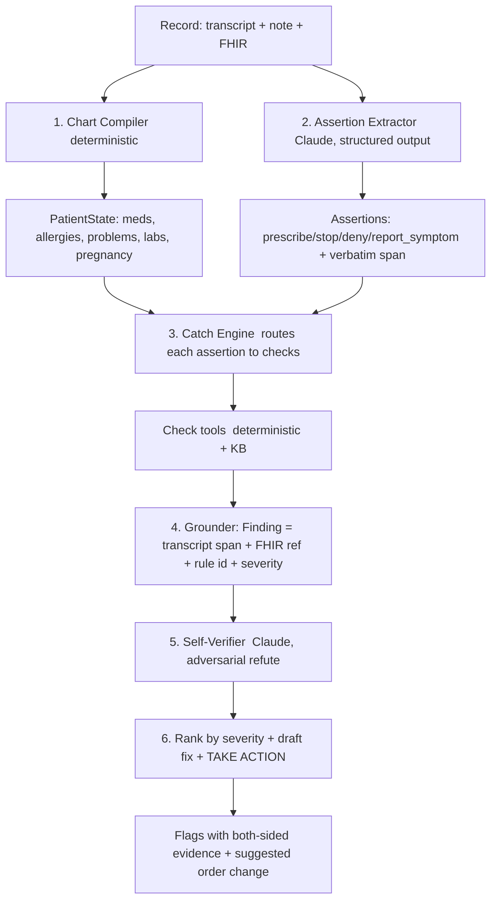

# Build Plan — Safety-Catch Engine
### Record Discrepancy Detector (#1) + Drug Adverse-Effect Alert (#2), one agentic loop

> **Thesis.** Don't build two apps. Build **one** minimal-but-technically-deep agent —
> a *safety-catch engine* — and ship both detectors as **checks that plug into the same
> loop**. That's the "extensible catch engine" vision from the idea doc, made concrete:
> the contradiction detector is the flagship; the adverse-effect alert is the second
> plugin that proves the architecture generalizes.

---

## 0. What's already done (data)

`data/` holds **100 labeled records** in Abridge's exact schema, with a planted,
both-sided-grounded discrepancy in each (or a clean control), plus a `labels.jsonl`
answer key kept separate from the records. See `data/README.md`. This gives us
something rare for a hackathon: a **live, quantitative eval** — precision/recall per
check — which is catnip for Abridge (they build clinical eval frameworks).

The generator's clinical KBs (drug classes, allergy cross-reactivity, renal thresholds,
interaction pairs, ADR lists) are **reused verbatim** as the engine's deterministic
tool backends. We built the eval and half the engine at once.

---

## 1. The core idea: neuro-symbolic auditor, not a generator

Two philosophies collide in clinical AI. Generators (write the note, write the summary)
are commodity and ban-adjacent here. **Auditors** — catch what a human missed — are
rarer, more defensible, and match Abridge's taste. Our engine is an auditor.

The technical spine is **neuro-symbolic**:

- **LLM (Claude)** does the two things only an LLM can: turn messy conversation into
  **typed clinical assertions**, and **adversarially self-verify** candidate flags.
- **Deterministic clinical rules** do the safety-critical reasoning: cross-reactivity,
  renal thresholds, interaction pairs. These are **auditable, testable, and never
  hallucinate** — exactly what you want deciding "is this drug dangerous."

Minimal (one loop, small tools, no framework, no vector DB → **ban-safe**: not RAG, not
a chatbot, not a dashboard). Complex (structured tool-calling + a symbolic rule engine +
parallel adversarial verification + dual-sided grounding + severity ranking + an action).

---

## 2. Architecture — the loop

### Stage-by-stage

**1. Chart Compiler — deterministic, no LLM.** Parse `encounter_fhir.related_resources`
+ `patient_context` into a normalized `PatientState`: active meds `{name, class, rxnorm,
dose}`, allergies `{label, class}`, problem list, latest labs (eGFR, K, A1c, INR),
pregnancy flag. Pure Python, cheap, reliable. This *is* the "structured patient state"
from the idea doc.

**2. Assertion Extractor — Claude, forced structured output.** One call over
transcript+note → a typed list of `ClinicalAssertion`:
`{kind: prescribe|continue|stop|deny_history|report_symptom|state_fact, drug?, dose?,
condition?, symptom?, verbatim_span}`. The `verbatim_span` is the grounding on the
*conversation* side and is required — no span, no assertion.

**3. Catch Engine — deterministic dispatch to check tools.** For each assertion, route
to applicable checks. Each check is a small tool backed by a curated KB:

| Tool | Fires on | Backend |
|---|---|---|
| `check_drug_allergy(drug, allergies)` | `prescribe` | cross-reactivity table |
| `check_renal_dose(drug, eGFR)` | `prescribe`/`continue` | renal threshold table |
| `check_drug_drug(drug, active_meds)` | `prescribe` | interaction pairs |
| `check_duplicate(drug, active_meds)` | `prescribe` | drug-class table |
| `check_dropped_med(active_meds, assertions)` | whole visit | set-difference |
| `check_history(deny_condition, problems)` | `deny_history` | problem-list match |
| `check_teratogen(drug, pregnancy)` | `prescribe` | teratogen list |
| **`check_adverse_event(symptoms, active_meds)`** | `report_symptom` | **ADR table → Detector #2** |

**4. Grounder.** Each hit becomes a `Finding` with the exact transcript span **and** the
exact FHIR `resource_id` (+ display) — both sides cited. Structurally identical to our
label objects, so scoring is a direct join.

**5. Self-Verifier — Claude, adversarial.** For each candidate `Finding`, a *separate*
call is prompted to **refute**: "here is the flag and both pieces of evidence — is this a
real, clinically-actionable problem, or a false positive? Default to *refute* if
uncertain." This is the alert-fatigue killer and the trust story. Findings run in
parallel; the flagship check can use N-of-M voting.

**6. Rank + Act.** Survivors ranked by severity; Claude drafts the concrete fix (seeded
by the KB's `suggested_fix`), and the agent **takes an action** — emits a structured flag
/ writes a review comment / drafts an order-change proposal for the clinician to accept
or dismiss. Taking action satisfies the "genuinely agentic + takes action" requirement.

---

## 3. The two detectors, on one engine

- **Detector #1 — Record Discrepancy** = checks 1–7 (contradiction: *assertion vs
  chart*). Flagship demo case: **metformin ordered at eGFR 24**, and **amoxicillin ordered
  with a charted penicillin allergy**.
- **Detector #2 — Drug Adverse-Effect Alert** = the `check_adverse_event` plugin (causal
  association: *reported symptom ↔ active med*). Same extract→check→ground→verify→act loop;
  different KB and a different question ("could this drug be causing this symptom?").
  Flagship case: patient on lisinopril reports a **new dry cough** → flag possible
  ACE-inhibitor cough → suggest switch to an ARB.

The payoff for judges: *"same engine, two safety nets — and the second one took 30 lines,
because everything else was already there."* That's the extensibility argument, demoed.

---

## 4. Three ways to build the loop — pick one (discussion)

The engine is fixed; how much we let Claude *drive* is the real design choice.

**Option A — Deterministic router, LLM at the edges.** Python routes assertions to
checks; Claude only extracts assertions and self-verifies. **Most reliable, cheapest,
most legible** (you can point at the rule that fired). Weakness: coverage is exactly the
KB. → *The safe 5-hour MVP.*

**Option B — Claude as the tool-calling agent.** Give Claude the check tools + the chart
and let it run an agentic loop — *it* decides which checks to call per assertion,
re-checks, and self-verifies (Anthropic `tool_runner` / manual tool loop). **Most
"genuinely agentic," best trace to show, highest originality.** Weakness: variance, token
cost, needs guardrails so the flagship always fires.

**Option C — Hybrid (recommended).** Deterministic router *guarantees* the flagship
checks fire every time (demo reliability), **and** a Claude "chief-resident" meta-agent
can (a) invoke any check tool on its own initiative for assertions the router didn't cover
and (b) own the adversarial verify + fix drafting. Deterministic backbone for trust +
agentic surface for the wow.

> **Recommendation:** build **A** first (get to a working, scored end-to-end by hour 3),
> then layer **C**'s agentic surface if ahead. This is the idea doc's "one check rock-solid
> first, pitch the full net" discipline.

---

## 5. Tech stack (ban-safe by construction)

- **Claude API** (Messages + tool use / `tool_runner`) — `claude-opus-4-8` for
  extraction/verify quality, `claude-haiku-4-5` for cheap parallel refuters. Structured
  output via tool schemas.
- **Python** engine (~1 file per stage, a few hundred lines total). No LangChain, **no
  vector store / no RAG**, **no Streamlit/dashboard**, **no chatbot**. The KBs are the ones
  already in `data/generate_dataset.py`.
- **UI (thin, not the product):** a minimal viewer that plays a transcript and pops the
  flags with both-sided evidence + the suggested fix. It *presents* the agent; it isn't the
  feature.

---

## 6. Eval harness — our unfair advantage

Because we have 100 labeled records, we run a real scorer the whole time:

- **Join** engine findings to `labels.jsonl` by `id`; match on `(type, drug/condition)`.
- **Metrics:** precision / recall / F1 per check, a **severity-weighted** score (missing a
  high-severity drug–allergy flag hurts more than a moderate duplicate), and a
  **false-positive rate on the 22 controls / near-misses** (the number clinicians care
  about). Report the self-verifier's FP reduction before/after.
- This makes the demo *quantitative*: "94% recall on high-severity catches, 2 false
  positives across 22 controls" beats any hand-picked anecdote — and speaks Abridge's
  language.

---

## 7. Five-hour timeline (MVP discipline)

| Time | Milestone |
|---|---|
| 0:00–0:30 | Chart Compiler → `PatientState` (reuse KBs). Load records. |
| 0:30–1:15 | Assertion Extractor (Claude structured output) + span check. |
| 1:15–2:15 | 3 flagship checks wired: allergy, renal-dose, interaction. Grounding. |
| 2:15–2:45 | Eval harness live → first P/R numbers. |
| 2:45–3:30 | Self-Verifier (adversarial) → watch FP rate drop on controls. |
| 3:30–4:00 | `check_adverse_event` plugin → **Detector #2 online** (proves extensibility). |
| 4:00–4:30 | Rank + draft-fix + action; thin viewer. |
| 4:30–5:00 | LLM-naturalize the ~10 demo transcripts; record 1-min video. |

Cut-lines if behind: drop interaction → ship allergy + renal only; drop the viewer →
show the scored trace. **Never ship 5 half-built checks.**

---

## 8. One-minute demo script

1. Real-looking visit plays; clinician orders metformin. (2 s)
2. Engine fires: **"⚠ eGFR 24 — metformin contraindicated,"** transcript line + chart lab
   both highlighted, suggested fix. (8 s)
3. Second case: **penicillin allergy vs amoxicillin order** — caught and grounded. (6 s)
4. A near-miss the self-verifier **suppresses** → "no false alarm." (6 s)
5. Flip to Detector #2: **new cough on lisinopril → ACE-inhibitor cough alert**, same
   engine. (8 s)
6. Close on the scoreboard: recall on high-severity catches + FP rate on controls. (5 s)

---

## 9. Risks & mitigations

| Risk | Mitigation |
|---|---|
| Extractor misses an assertion | require verbatim spans; deterministic `check_dropped_med` doesn't depend on extraction; eval surfaces misses immediately |
| False positives erode trust | adversarial self-verifier + the 22 controls as a standing FP test |
| "Is it *really* agentic?" | Option C: Claude drives tool-calls + self-verifies + takes an action, with a visible trace |
| Templated transcripts look thin on camera | LLM-naturalize only the ~10 demo records, preserving planted spans verbatim |
| Judges suspect the data is rigged | show the generator + that the detector never reads `labels.jsonl`; report FP on unseen-style controls |

---

## 10. Roadmap (pitch the full net, demo the two that work)

Same loop, more plugins: **omission** (transcript says it, note drops it),
**note-vs-transcript hallucination**, and the temporal checks — **dropped result**
(already seeded, 5 records), **dropped referral**, **external exposure**. Each is a new
tool on the identical extract→check→ground→verify→act loop. That's the story: *a growing
safety net, one engine.*
